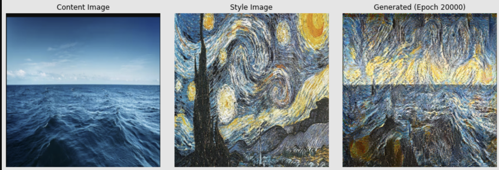

# Neural Style Transfer with VGG19 (TensorFlow)

This project implements **Neural Style Transfer** using the VGG19 architecture in TensorFlow. It blends the *content* of one image with the *style* of another to create new visuals.

---

## Features

- Load and preprocess images for VGG19
- Extract style and content features from images
- Compute style, content, and total variation loss
- Train with Adam optimizer; tuneable weights
- Save generated images at intervals for progress tracking

---

## Getting Started

### Requirements

- Python 3.x
- TensorFlow 2.x
- numpy
- matplotlib

pip install tensorflow numpy matplotlib

---

## Usage

1. **Place style and content images** in the `images/` folder:
    - Example: `images/style.jpg`, `images/Screenshot From 2025-08-23 23-29-41.png`

2. **Run the script** (edit image paths and parameters as needed):
    - Generated images will be saved in `save_here6/` during training.

---

---

## Output Example

Below are two generated images showing content-style blending:  
**Left:** Content Image | **Middle:** Style Image | **Right:** Generated Result

---

## Customization

- **Change images**: Point to any content/style images in your code
- **Training steps**: Edit iteration range in the loop
- **Loss weights**: Tune `alpha`, `beta`, and `tv_weight` as desired

---

## License

Open-source. Use for personal/educational projects.

---

**Create new art by mixing styles and content!**
